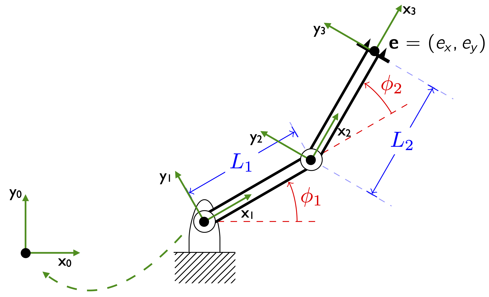
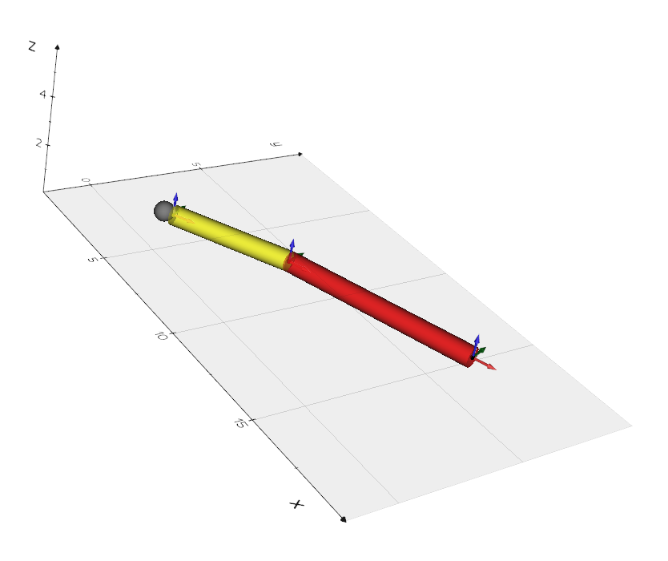
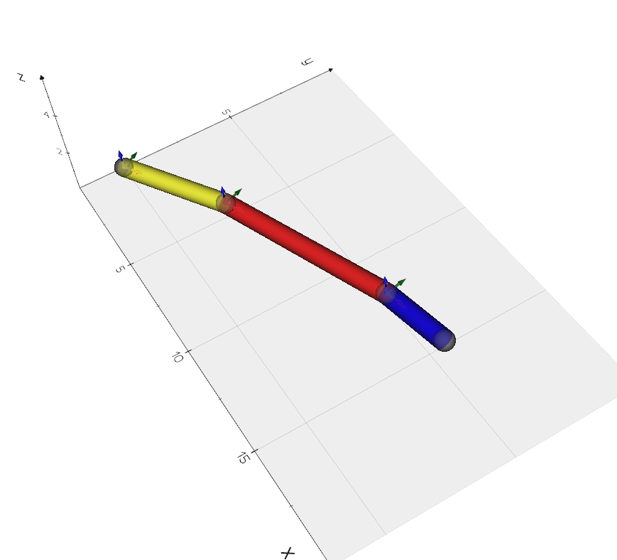
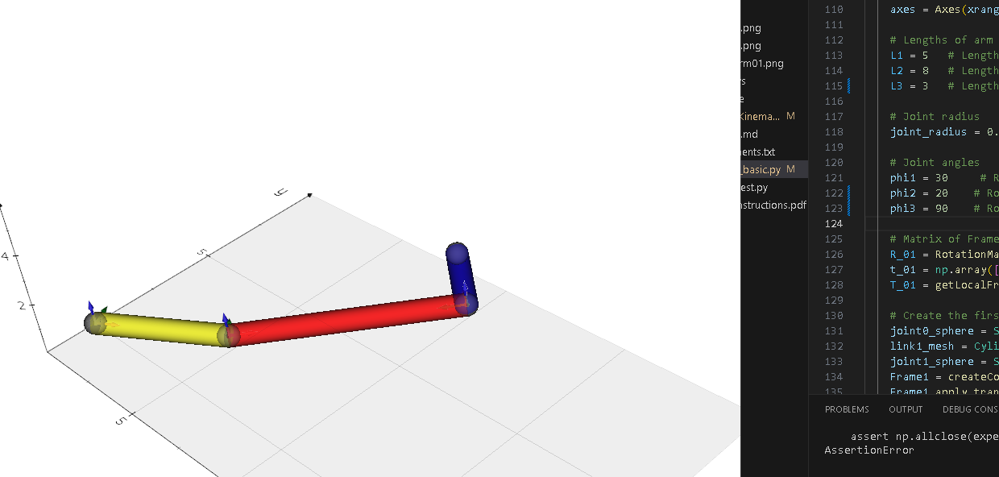
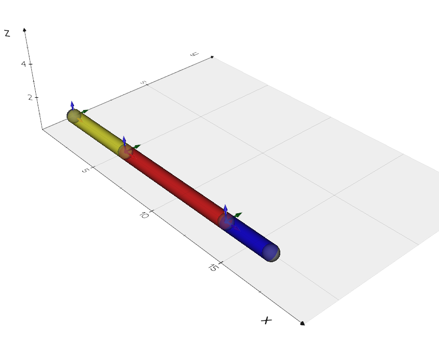
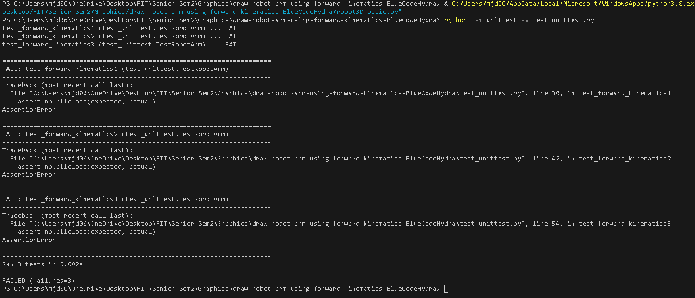

# robot-arm-3D-basic
Sample code for basic robot arm using transformations 

========================================================================\n
Image - Untouched code

========================================================================\n
Image 1 - Spheres placed along joints

========================================================================\n
Image 2 - Angle Change

========================================================================\n
Image 3 - Angle Change

========================================================================\n
Image 4 - Angle Change

========================================================================\n
Image 5 - Failed Tests

